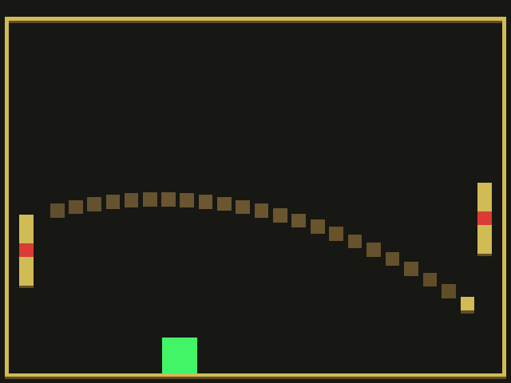

# Precision Pong

Author: Kyle Jannak-Huang

Design: Score points by hitting the green targets, lose points when the ball hits your side of the court. 
Hit curveballs by adding spin when hitting the ball, and get speed boosts by hitting shots with the center of the paddle.
The AI was adjusted to generally aim towards the targets, as well, instead of in random directions.

Screen Shot:

How To Play:

Use the mouse cursor to control your paddle and hit the ball. Aim at the green targets to score. 
The ball will bounce at a steeper angle when it contacts the paddle further away from center, as with normal Pong.
Make sure to block your opponent's shots before they hit your side of the court, or you will lose points.
Hit curveballs by moving the paddle as you hit the ball. The curve is proportional to the speed of the paddle.
The ball will get faster over time, and the AI paddle speed will get faster the more points you have.

This game was built with [NEST](NEST.md).
